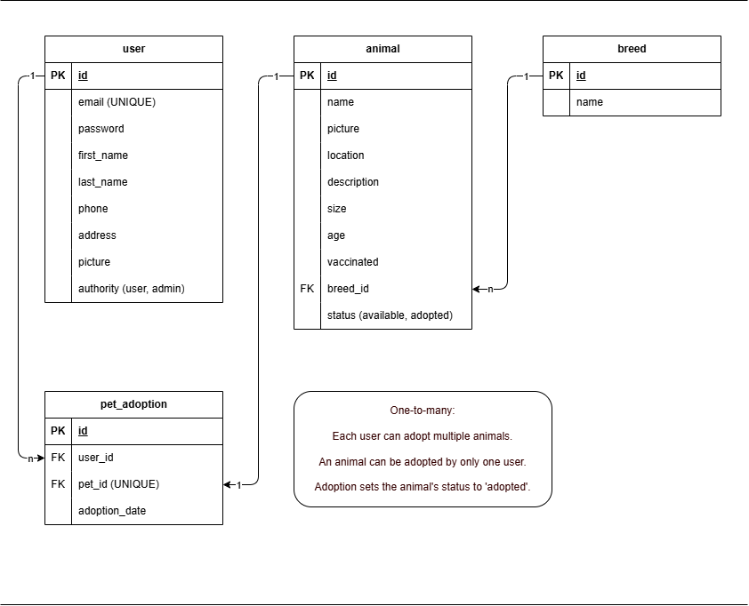
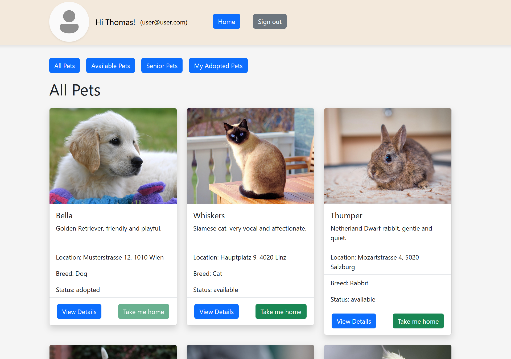
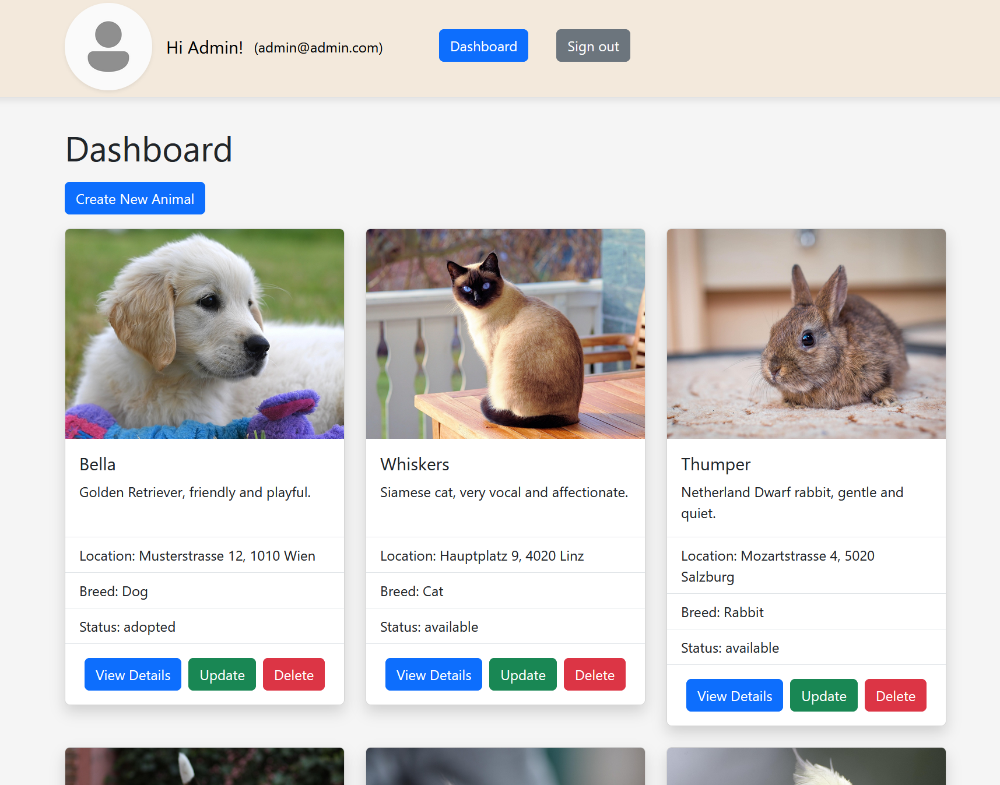
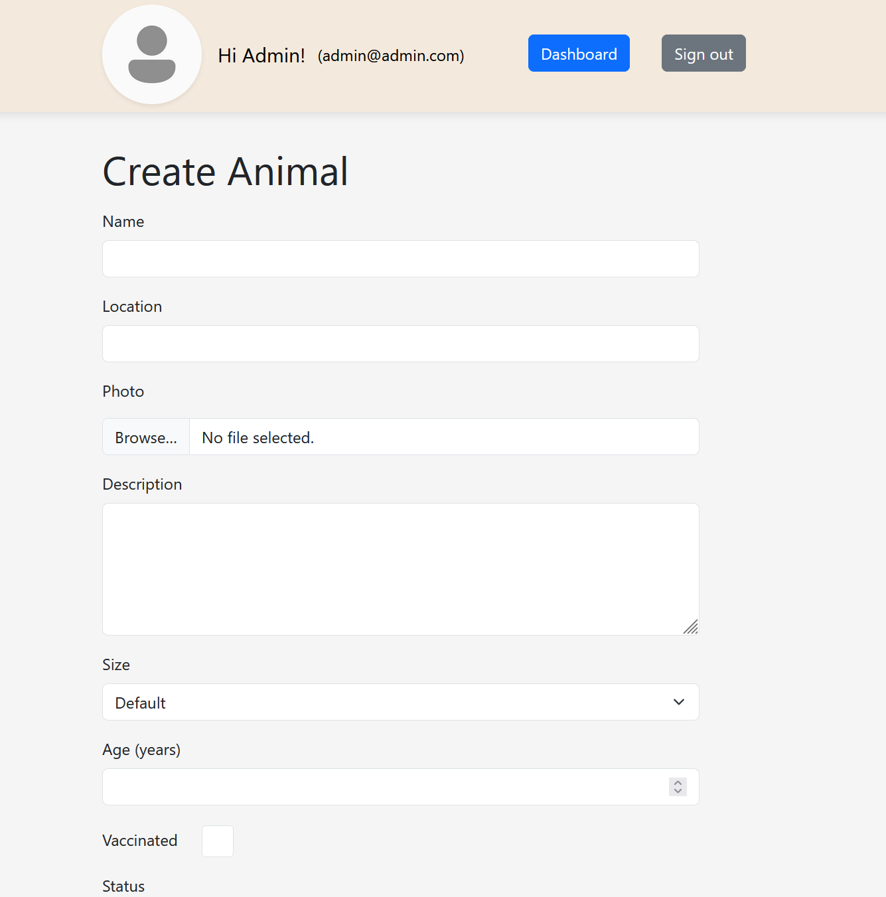
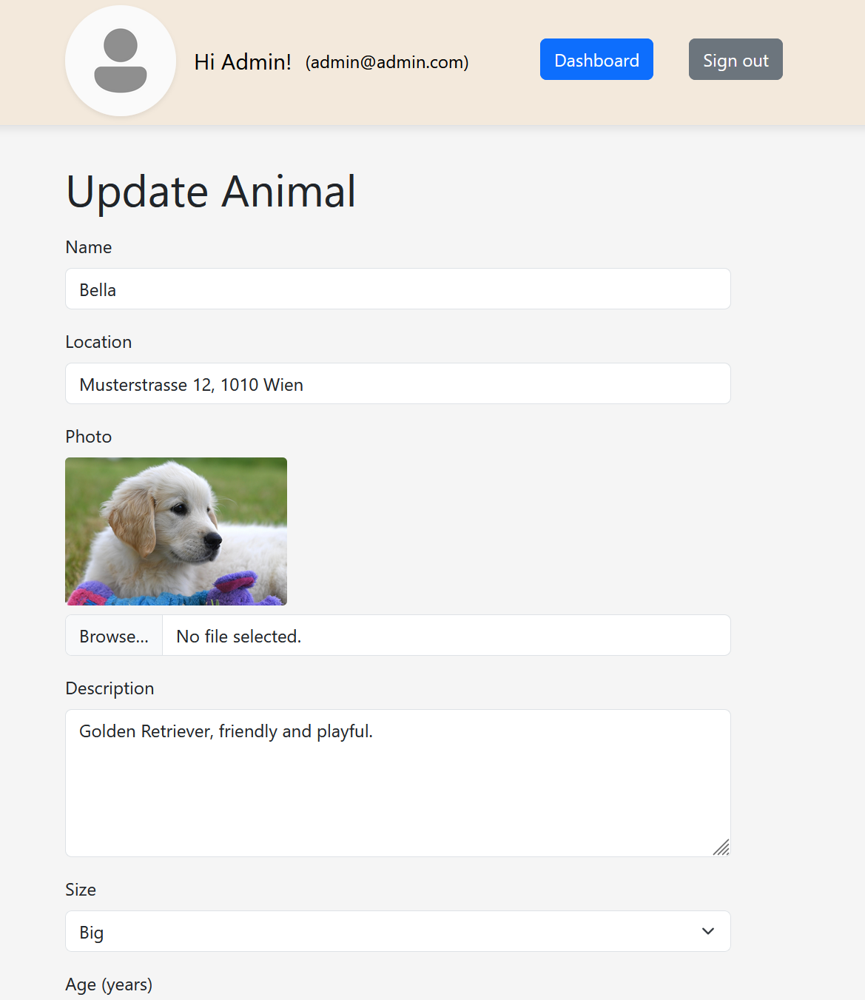
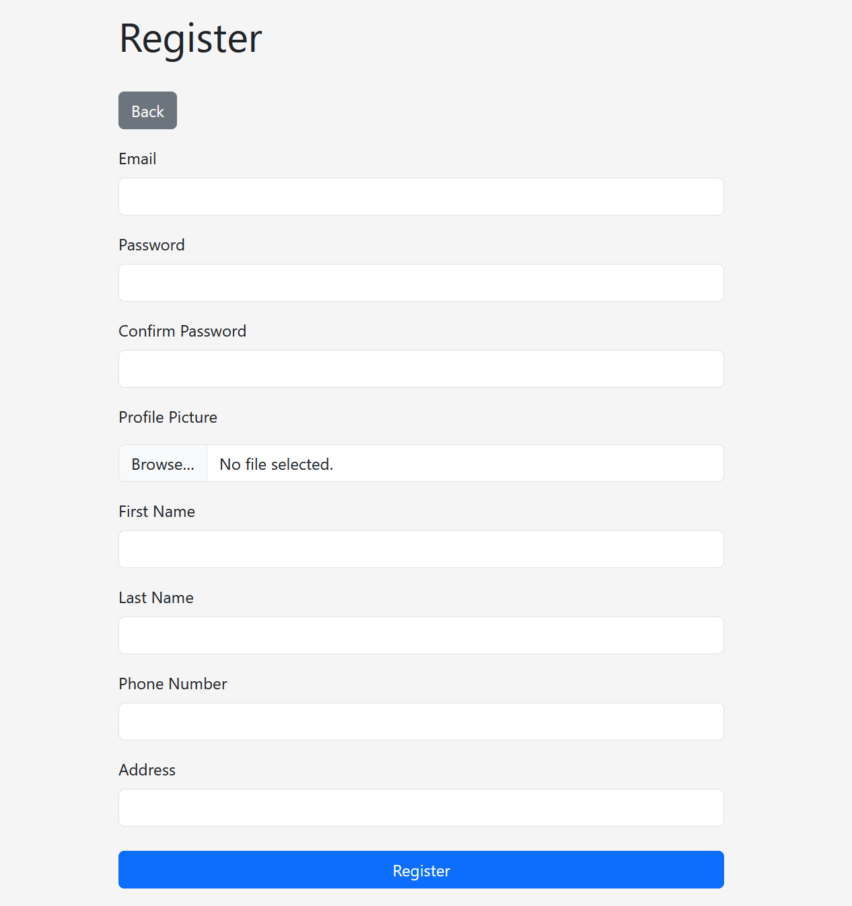
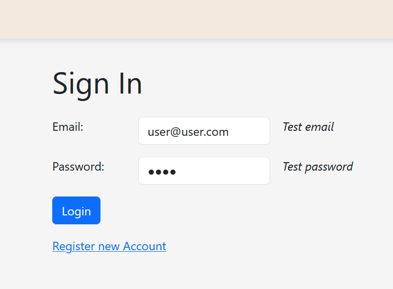
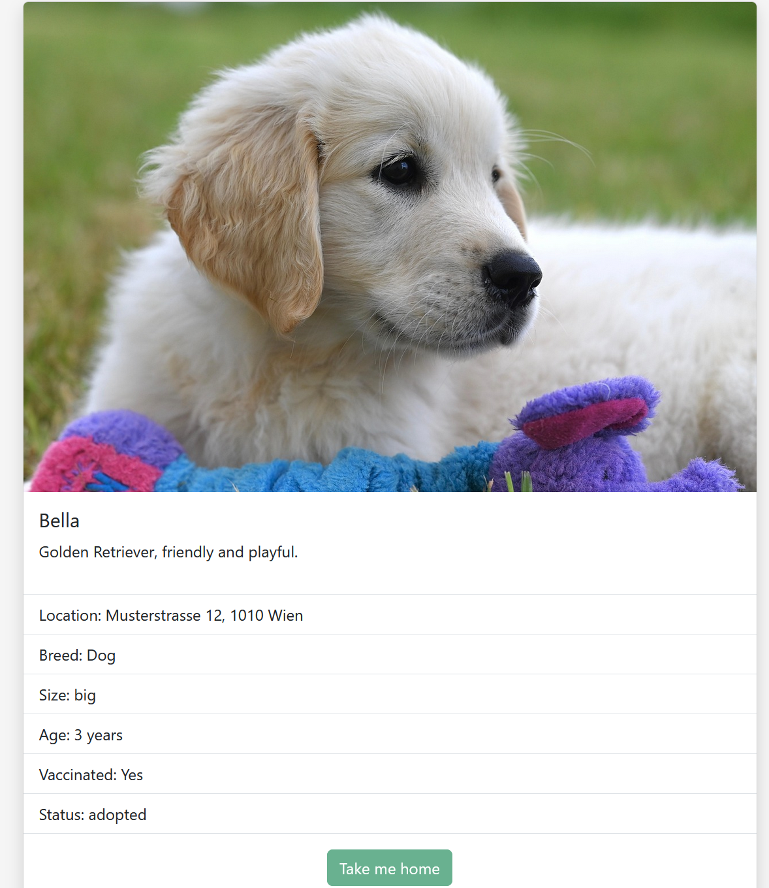

# Animal Adoption

A web app built with PHP, MySQL and Bootstrap where logged-in users can adopt animals.
An administrator can create, update, delete animals.

[Live Demo](https://kim.codefactory.live/animal_adoption)

## Screenshots

<table>
  <tr>
    <td colspan="2">
      
    </td>
  </tr>
  <tr>
    <td colspan="2">
      
    </td>
  </tr>
  <tr>
    <td colspan="2">
      
    </td>
  </tr>
  <tr>
    <td>
      
    </td>
    <td>
      
    </td>
  </tr>
  <tr>
    <td>
      
    </td>
    <td>
      
    </td>
  </tr>
  <tr>
    <td colspan="2">
      
    </td>
  </tr>
</table>
